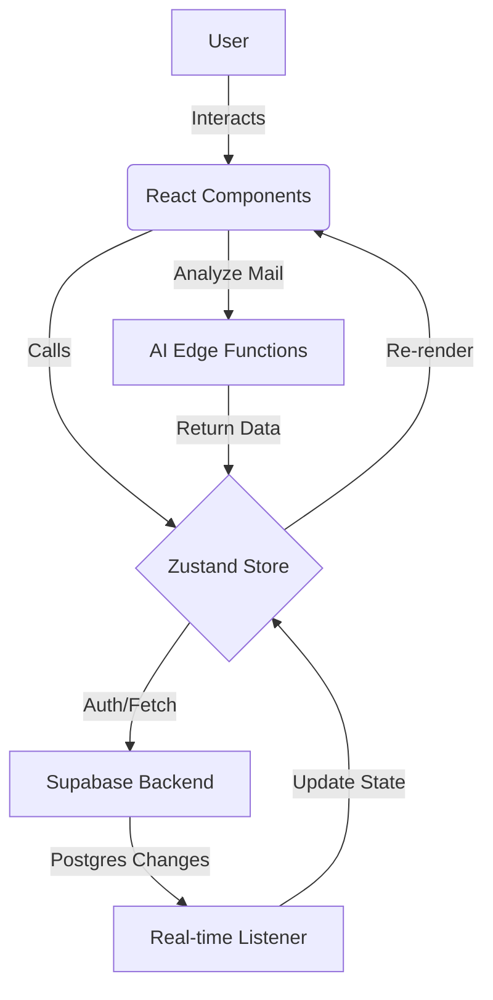

# 📧 Smart Mail UI & Assistant

[](https://opensource.org/licenses/MIT)
[](https://react.dev/)
[](https://vitejs.dev/)
[](https://supabase.com/)

An advanced, agent-integrated email client designed for the modern web. This project provides a premium, Gmail-like interface with a focus on **real-time synchronization**, **AI-driven insights**, and **extensible architecture** for open-source contributors.

---

## 🏗️ Architecture & Data Flow

Understanding how data moves through the application is key to contributing.

### 🔄 System Flowchart



### 📡 Real-time Sync Logic

The application uses a "Surgical Update" pattern. Instead of reloading the entire inbox, we listen for specific Row Level Security (RLS) enabled events from Supabase to update the UI instantly.

---

## ✨ Key Features

- **🚀 Instant Real-time Sync:** Powered by Supabase Postgres changes.
- **🧠 AI Assistant Integration:** Hooks for auto-summarization and smart emotional analysis of drafts.
- **📱 Responsive Glassmorphism UI:** Built with Tailwind CSS for a premium, lightweight feel.
- **🔐 Secure Auth Protocol:** Built-in multi-account session management.
- **🔍 Advanced Search:** Client-side filtering combined with server-side indexing.

---

## 🛠️ Tech Stack

| Layer | Technology |
| :--- | :--- |
| **Frontend** | React 19, Vite |
| **Styling** | Tailwind CSS v4, Lucide Icons, Framer Motion |
| **State Management** | Zustand (Custom Surgical Update Middleware) |
| **Backend/DB** | Supabase (PostgreSQL, Realtime, Edge Functions) |
| **Tooling** | ESLint, PostCSS |

---

## 🚀 Getting Started

To join the project as a developer or contributor, follow these steps:

### 1. Prerequisites

- **Node.js**: v18.x or higher
- **npm**: v9.x or higher
- **Supabase Account**: A project with an `emails` table.

### 2. Installation

```bash
# Clone the repository
git clone https://github.com/Rajveerx11/smart-mail-ui.git

# Enter development directory
cd smart-mail-ui

# Install dependencies
npm install
```

### 3. Environment Configuration

Create a `.env` file in the root based on `.env.example`. **NEVER** commit this file to GitHub.

```env
VITE_SUPABASE_URL=your_project_url_here
VITE_SUPABASE_ANON_KEY=your_anon_key_here
VITE_API_URL=http://localhost:8000
```

### 4. Database Setup (Supabase)

Import the schema provided in the `/supabase` folder to your project to ensure the `emails` table matches the frontend expectation.

### 5. Launch

```bash
npm run dev
```

---

## 📁 Project Structure

```text
src/
├── components/      # Atomic UI components (Sidebar, Topbar, Modals)
├── store/           # Zustand state logic & Supabase subscriptions
├── services/        # API and AI Edge Function wrappers
├── utils/           # Time formatters, text parsers, and helpers
├── pages/           # High-level layouts (Inbox, Login)
└── assets/          # Static images and global styles
```

---

## 🤝 Contributing

We welcome contributions from everyone! To keep things organized:

1. **Fork** the repository.
2. **Create a branch** for your feature (`git checkout -b feat/NewComponent`).
3. **Implement your changes** (ensure `npm run lint` passes).
4. **Write a descriptive commit** following [Conventional Commits](https://www.conventionalcommits.org/).
5. **Open a Pull Request** against the `main` branch.

### 💡 Ideas for Contribution

- [ ] Implement a "Drafts" folder logic.
- [ ] Add dark mode support using Tailwind themes.
- [ ] Integrate a richer AI summarization display.
- [ ] Add unit tests for the Zustand store.

---

## �️ Security & Privacy

- **No Data Leaks:** This project is configured to ignore `.env` and `node_modules`.
- **API Rotation:** If you accidentally expose your `VITE_SUPABASE_ANON_KEY`, rotate it immediately in your Supabase dashboard.
- **RLS:** Always ensure Row Level Security is enabled on your Supabase tables.

---

## 📜 License

Distributed under the **MIT License**. See `LICENSE` for more information.

---

## 🗨️ Community & Support

- **Discord**: [Join our developer community]
- **Issue Tracker**: Use GitHub Issues for bug reports and feature requests.
- **Maintainer**: [Rajveer]

---
*Generated with ❤️ for the Open Source Community.*
