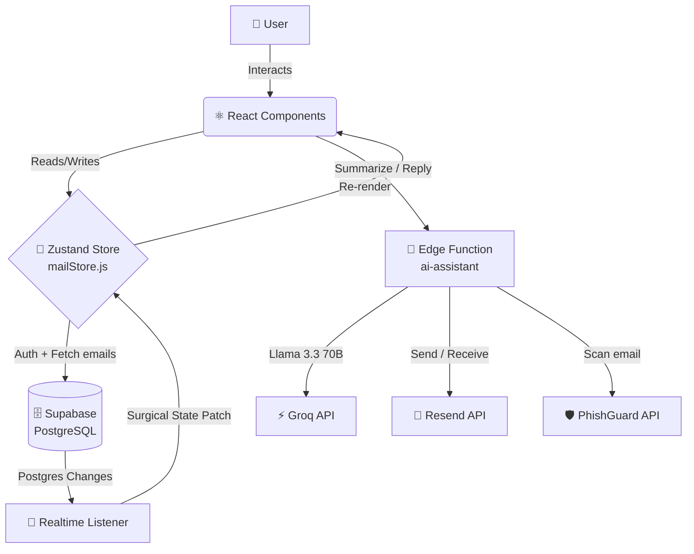

<div align="center">

# ✉️ Axon Mail

**A premium, AI-powered email client built for the modern web.**

[](https://opensource.org/licenses/MIT)
[](https://react.dev/)
[](https://vitejs.dev/)
[](https://supabase.com/)
[](https://tailwindcss.com/)
[](CONTRIBUTING.md)

<br/>

> **Axon Mail** (repo: `smart-mail-ui`) is a serverless, Gmail-like SPA with **real-time inbox sync**, **AI email summarization**, **smart reply drafting**, and **phishing detection** — all without a traditional backend server.

</div>

---

## 📖 Table of Contents

- [What is Axon Mail?](#-what-is-axon-mail)
- [Key Features](#-key-features)
- [Tech Stack](#-tech-stack)
- [Architecture & Data Flow](#️-architecture--data-flow)
- [Project Structure](#-project-structure)
- [Getting Started (Local Setup)](#-getting-started-local-setup)
- [Environment Variables](#-environment-variables)
- [Database Schema](#-database-schema)
- [How the AI Works](#-how-the-ai-works)
- [Phishing Detection](#-phishing-detection)
- [Contributing](#-contributing)
- [Security & Privacy](#️-security--privacy)
- [License](#-license)
- [Team](#-team)

---

## 🧠 What is Axon Mail?

Axon Mail is a **Single-Page Application (SPA)** that acts as a fully-functional email client. It connects to your own **Supabase** project for data storage, authentication, and real-time updates. All "server-side" logic (sending emails, AI analysis, inbound email webhooks) lives in a **single Supabase Edge Function** running on the **Deno** runtime — there is **no separate Express/FastAPI/Node server**.

### ✨ Key Features

| Feature | Description |
| :--- | :--- |
| 🚀 **Real-Time Inbox Sync** | New emails appear instantly via Supabase Realtime (WebSocket). No refresh needed. |
| 🧠 **AI Summarization** | Summarize any email into 3 bullet points using Groq's Llama 3.3 70B model. |
| ✍️ **Smart Reply Drafts** | Generate a professional reply draft with one click — auto-fills ComposeModal. |
| 🎣 **Phishing Detection** | Every inbound email is automatically scanned and quarantined if risk score ≥ 60. |
| 📎 **Attachment Support** | Send and receive file attachments, stored securely in Supabase Storage. |
| 🔐 **Session Auth** | Supabase Auth handles login, session persistence, and sign-out. |
| 🔍 **Advanced Search** | Filter emails by sender, subject, date range, and folder. |
| 💎 **Premium UI** | Glassmorphism design, Framer Motion animations, responsive layout. |

---

## 🛠️ Tech Stack

### Frontend

| Technology | Version | Role |
| :--- | :--- | :--- |
| **React** | 19.2.0 | UI component framework |
| **Vite** | 7.2.4 | Build tool & dev server |
| **Zustand** | 5.0.10 | Global state management |
| **Tailwind CSS** | 3.4.17 | Utility-first CSS framework |
| **Framer Motion** | 12.28.1 | Animations & transitions |
| **Lucide React** | 0.562.0 | Icon library |
| **@supabase/supabase-js** | 2.91.0 | Supabase JS client |

### Backend (Serverless)

| Technology | Role |
| :--- | :--- |
| **Supabase** | PostgreSQL DB + Auth + Storage + Realtime |
| **Deno (Edge Functions)** | Runtime for all backend logic |
| **Groq API** | LLM inference — Llama 3.3 70B Versatile |
| **Resend API** | Sending & receiving emails + inbound webhooks |
| **PhishGuard API** | Self-hosted phishing detection (on Render) |

---

## 🏗️ Architecture & Data Flow

### High-Level System Diagram

```
┌──────────────────────────────────────────────────────────┐
│                     CLIENT (Browser)                      │
│          React 19 + Zustand + Tailwind + Framer Motion    │
└────────┬─────────────────┬──────────────────┬────────────┘
         │  REST/HTTP       │  WebSocket        │  REST/HTTP
         ▼                  ▼                   ▼
┌────────────────┐  ┌───────────────┐  ┌───────────────────┐
│ Supabase Edge  │  │   Supabase    │  │  PhishGuard API   │
│ Function (Deno)│  │   Realtime    │  │  (Render hosted)  │
│ ai-assistant/  │  │  (WebSocket)  │  └───────────────────┘
│   index.ts     │  └───────────────┘
└───┬────┬───┬───┘
    │    │   │
    ▼    ▼   ▼
┌──────┐┌──────┐┌──────────────────┐
│Resend││ Groq ││  Supabase        │
│ API  ││ API  ││  PostgreSQL      │
│      ││(LLM) ││  + Storage       │
└──────┘└──────┘└──────────────────┘
```

### Mermaid Flowchart


```mermaid
graph TD
    A[👤 User] -->|Interacts| B(⚛️ React Components)
    B -->|Reads/Writes| C{🐻 Zustand Store\nmailStore.js}
    C -->|Auth + Fetch emails| D[(🗄️ Supabase\nPostgreSQL)]
    D -->|Postgres Changes| E[📡 Realtime Listener]
    E -->|Surgical State Patch| C
    C -->|Re-render| B
    B -->|Summarize / Reply| F[🤖 Edge Function\nai-assistant]
    F -->|Llama 3.3 70B| G[⚡ Groq API]
    F -->|Send / Receive| H[📨 Resend API]
    F -->|Scan email| I[🛡️ PhishGuard API]
```

### Realtime "Surgical Update" Pattern

Instead of re-fetching the entire inbox on every change:

1. `subscribeToMails()` opens a WebSocket channel to Supabase Realtime.
2. When an email is **inserted**, **updated**, or **deleted** in PostgreSQL, an event fires.
3. `mailStore.js` patches **only the affected item** in the `mails[]` array.
4. Zustand's shallow equality ensures **only the changed component re-renders**.

This pattern delivers instant UI updates without network overhead.

---

## 📁 Project Structure

```
c:\Email-Server\                   ← repo root
├── .env                           # 🔒 Your secrets (NEVER commit this)
├── .env.example                   # Template for required env vars
├── index.html                     # HTML shell — mounts React at #root
├── package.json                   # npm scripts & dependencies
├── vite.config.js                 # Vite build configuration
├── tailwind.config.js             # Tailwind CSS theme
├── postcss.config.js              # PostCSS (Tailwind + Autoprefixer)
├── eslint.config.js               # ESLint rules (React Hooks + Refresh)
│
├── src/
│   ├── main.jsx                   # React DOM entry point
│   ├── App.jsx                    # Root layout — auth init, realtime, routing
│   ├── index.css                  # Global styles & Tailwind directives
│   │
│   ├── lib/
│   │   └── supabase.js            # Supabase client initialisation
│   │
│   ├── store/
│   │   └── mailStore.js           # ⭐ CENTRAL BRAIN — all state & API calls
│   │
│   ├── utils/
│   │   ├── mailClassifier.js      # Rule-based email → {folder, category}
│   │   ├── spamDetector.js        # Score-based spam boolean
│   │   └── autoReply.js           # Template auto-reply generator
│   │
│   ├── pages/
│   │   └── ViewProfile.jsx        # Full profile management page
│   │
│   └── components/
│       ├── Topbar.jsx             # Top nav: logo, search, refresh, avatar
│       ├── Sidebar.jsx            # Folder nav & Compose button
│       ├── MailTabs.jsx           # Category tabs (Primary/Social/Promos)
│       ├── MailList.jsx           # Scrollable email list
│       ├── MailItem.jsx           # Single email row
│       ├── MailView.jsx           # Email viewer + AI sidebar
│       ├── ComposeModal.jsx       # Floating compose window
│       ├── AdvancedSearch.jsx     # Multi-field search overlay
│       ├── LoginPage.jsx          # Auth page
│       ├── AuthModal.jsx          # Account management modal
│       ├── SmartBadge.jsx         # Category/status pill badge
│       └── SplashScreen.jsx       # Animated brand intro
│
└── supabase/
    ├── config.toml                # Supabase local dev config
    └── functions/
        └── ai-assistant/
            ├── index.ts           # ⭐ THE ONLY BACKEND — all routes here
            └── deno.json          # Deno module config
```

> **Key insight for newcomers:** Almost all application logic lives in two files:
> - **`src/store/mailStore.js`** — frontend state + all API calls
> - **`supabase/functions/ai-assistant/index.ts`** — all backend logic

---

## 🚀 Getting Started (Local Setup)

### Prerequisites

Before you begin, make sure you have:

- **Node.js** v18 or higher → [nodejs.org](https://nodejs.org/)
- **npm** v9 or higher (bundled with Node)
- **A Supabase account** → [supabase.com](https://supabase.com/) (free tier works)
- **Supabase CLI** (optional, for deploying Edge Functions) → [docs.supabase.com/docs/guides/cli](https://supabase.com/docs/guides/cli)

### Step 1 — Clone the repository

```bash
git clone https://github.com/Rajveerx11/smart-mail-ui.git
cd smart-mail-ui
```

### Step 2 — Install dependencies

```bash
npm install
```

### Step 3 — Configure environment variables

Copy the example file and fill in your credentials:

```bash
cp .env.example .env
```

Open `.env` and set these values:

```env
# Your Supabase project URL (found in: Dashboard → Settings → API)
VITE_SUPABASE_URL=https://your-project-id.supabase.co

# Your Supabase anon/public key (found in: Dashboard → Settings → API)
VITE_SUPABASE_ANON_KEY=your_anon_key_here

# Legacy variable — leave as-is or remove
VITE_API_URL=http://localhost:8000
```

> ⚠️ **Never commit your `.env` file.** It is already listed in `.gitignore`.

### Step 4 — Set up Supabase (Database)

1. Go to your **Supabase Dashboard** and open your project.
2. Navigate to **Table Editor** → create a table called `emails` with the columns listed in the [Database Schema](#-database-schema) section below.
3. Enable **Row Level Security (RLS)** on the table (required for Realtime).
4. Enable **Realtime** for the `emails` table (Table Editor → Realtime toggle).

### Step 5 — Run the dev server

```bash
npm run dev
```

The app will be available at **http://localhost:5173**

### Step 6 (Optional) — Deploy the Edge Function

If you want AI features and email sending to work, deploy the backend:

```bash
# Install Supabase CLI first: https://supabase.com/docs/guides/cli
supabase login
supabase link --project-ref your-project-id
supabase functions deploy ai-assistant
```

Then add the required secrets in **Supabase Dashboard → Project Settings → Edge Functions → Secrets**:

| Secret | Where to get it |
| :--- | :--- |
| `RESEND_API_KEY` | [resend.com](https://resend.com) |
| `GROQ_API_KEY` | [console.groq.com](https://console.groq.com) |
| `SUPABASE_SERVICE_ROLE_KEY` | Supabase → Settings → API |

---

## 🔐 Environment Variables

### Frontend (`.env` file)

| Variable | Required | Description |
| :--- | :--- | :--- |
| `VITE_SUPABASE_URL` | ✅ Yes | Your Supabase project URL |
| `VITE_SUPABASE_ANON_KEY` | ✅ Yes | Supabase public (anon) API key |
| `VITE_API_URL` | ❌ Legacy | Points to a deprecated FastAPI endpoint — unused |

### Backend (Supabase Edge Function Secrets)

| Variable | Description |
| :--- | :--- |
| `SUPABASE_SERVICE_ROLE_KEY` | Admin key for DB writes from the Edge Function |
| `RESEND_API_KEY` | For sending & receiving emails |
| `GROQ_API_KEY` | For AI summarization & reply drafting |

---

## 🗄️ Database Schema

### `public.emails` table

| Column | Type | Description |
| :--- | :--- | :--- |
| `id` | UUID | Primary key (auto-generated) |
| `created_at` | Timestamptz | Creation timestamp |
| `sender` | Text | Sender email address |
| `recipient` | Text | Recipient email address |
| `subject` | Text | Email subject line |
| `body` | Text | Email body (HTML or plain text) |
| `summary` | Text | AI-generated summary (cached after first run) |
| `ai_draft` | Text | AI-generated reply draft (cached after first run) |
| `folder` | Text | `'Inbox'` \| `'Sent'` \| `'Trash'` \| `'Spam'` |
| `category` | Text | `'Primary'` \| `'Social'` \| `'Promotions'` \| `'Updates'` |
| `read_status` | Boolean | `true` if the email has been read |
| `is_spam` | Boolean | `true` if flagged as spam |
| `message_id` | Text | External message ID from Resend |
| `attachments` | JSONB | Array of `{ filename, mime_type, size, storage_path }` |
| `phishing_score` | Integer | Phishing risk score 0–100 |
| `quarantine_status` | Boolean | `true` if email is quarantined |
| `quarantine_reason` | Text | Pipe-delimited quarantine reasons |

### `quarantine_logs` table (Secondary Supabase project)

| Column | Type | Description |
| :--- | :--- | :--- |
| `email_id` | UUID | Reference to the quarantined email |
| `sender` | Text | Sender address |
| `subject` | Text | Email subject |
| `phishing_score` | Integer | Risk score at time of action |
| `risk_level` | Text | `Low` \| `Medium` \| `High` \| `Critical` |
| `reasons` | Text | Pipe-delimited risk reasons |
| `action` | Text | `'quarantined'` \| `'released'` \| `'deleted'` |

---

## 🤖 How the AI Works

AI features are powered by **Groq's Llama 3.3 70B Versatile** model, called from inside the Supabase Edge Function.

| Feature | Endpoint | What it does |
| :--- | :--- | :--- |
| **Summarize** | `POST /ai-assistant/summarize` | Summarizes email body into 3 bullet points |
| **Smart Reply** | `POST /ai-assistant/generate-reply` | Drafts a professional reply |

**Important:** AI results are **persisted to the `emails` table** (`summary`, `ai_draft` columns). They are computed **once on demand** and served from the database on subsequent views — no repeated API calls.

---

## 🛡️ Phishing Detection

Every inbound email is automatically scanned by the **PhishGuard API** (self-hosted on Render):

```
New email arrives via Resend webhook
  → autoScanMail() triggered in mailStore.js
  → POST { sender, subject, body } to PhishGuard API
  → Response: { score (0–100), reasons, risk_level }

IF score ≥ 60:
  → emails.quarantine_status = true
  → emails.quarantine_reason = pipe-delimited reasons
  → INSERT into quarantine_logs (secondary Supabase)

IF score < 60:
  → Email appears normally in Inbox
```

Users can **release** or **delete** quarantined emails from the UI.

---

## 🤝 Contributing

We welcome contributions from everyone! Please read our **[CONTRIBUTING.md](CONTRIBUTING.md)** for the full guide covering:

- Branch naming conventions
- Commit message format (Conventional Commits)
- PR process
- Code style guidelines
- Good first issues

### Quick contribution steps

```bash
# 1. Fork the repo on GitHub
# 2. Clone your fork
git clone https://github.com/YOUR_USERNAME/smart-mail-ui.git

# 3. Create a feature branch
git checkout -b feat/your-feature-name

# 4. Make your changes, then check for linting errors
npm run lint

# 5. Commit using Conventional Commits format
git commit -m "feat: add dark mode toggle"

# 6. Push and open a Pull Request against main
git push origin feat/your-feature-name
```

### 💡 Good First Issues

Looking for a place to start? Here are some open tasks:

- [ ] Implement a **Drafts folder** — save compose content before sending
- [ ] Add **email threading** — group replies under the same thread
- [ ] Add **unit tests** for the Zustand store (`mailStore.js`)
- [ ] Build a **Notifications panel** for recent activity
- [ ] Implement **server-side pagination** to replace `SELECT *`
- [ ] Add **keyboard shortcuts** (e.g., `C` to compose, `R` to reply)

---

## 🛡️ Security & Privacy

- `.env` and `node_modules` are both in `.gitignore` — no secrets can be accidentally committed.
- If you accidentally expose your `VITE_SUPABASE_ANON_KEY`, **rotate it immediately** in Supabase Dashboard → Settings → API.
- Always enable **Row Level Security (RLS)** on all Supabase tables.
- The `SUPABASE_SERVICE_ROLE_KEY` must **only** live in Edge Function secrets — never on the client.

---

## 📜 License

Distributed under the **MIT License**. See [`LICENSE`](LICENSE) for details.

---

## 👥 Team

| Name | Role |
| :--- | :--- |
| **Rajveer Vadnal** | Lead Developer & Maintainer |
| **Gaurav Gholave** | Contributor |
| **Vaibhav Bansode** | Contributor |
| **Jiya Tamboli** | Contributor |

---

<div align="center">

**Built with ❤️ for the Open Source Community**

[⭐ Star this repo](https://github.com/Rajveerx11/smart-mail-ui) · [🐛 Report a Bug](https://github.com/Rajveerx11/smart-mail-ui/issues) · [💡 Request a Feature](https://github.com/Rajveerx11/smart-mail-ui/issues)

</div>
